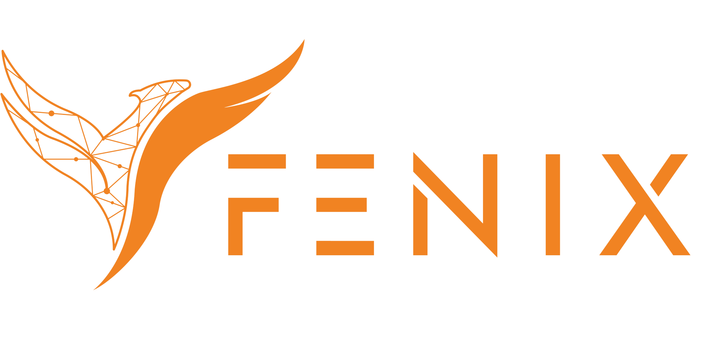



## Fénix 2.0

#### El módulo Fénix II será el software de creación del caso o reporte, donde se podrá realizar también la validación, asignación, revisión, auditoria, seguimiento, análisis y la creación del plan de acción, así como el seguimiento del mismo, la creación y muestra de sus indicadores e informes de la gestión; opciones de: AUTOEVALUACIÓN INSTITUCIONAL, GENERACIÓN DE INFORMES Y PLANES DE MEJORAMIENTO, MEDICIÓN Y ANÁLISIS PERMANENTE, SEGUIMIENTO EN TIEMPO REAL DE LAS ACCIONES DE MEJORA, GESTIÓN DEL RIESGO INDIVIDUAL, SEGURIDAD DEL PACIENTE.
